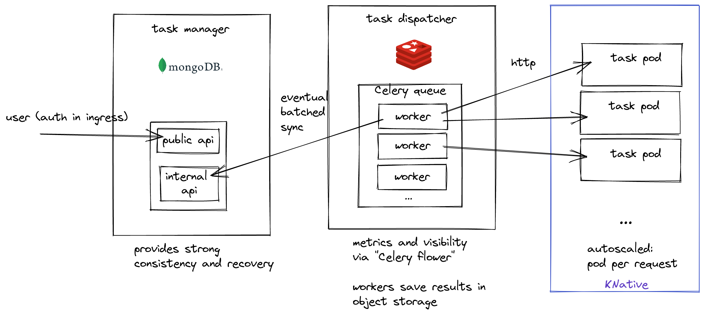

# Horizontally Scalable Task Queue 



### Overview
A scalable and reliable task queue for Kubernetes.
Scaling is done through Knative based autoscaling. Strong consistency is provided by MongoDB and used for recovery in case of failure.

Currently only one task is aviavlble: extracting SBOM from a dockerhub image using Syft but new tasks can easily be added.

Task scheduling is done by [Celery](https://docs.celeryq.dev) with [Flower](flower.readthedocs.io) for metrics and manaual inspection. Celery workers currenlty have two "work" types: run tasks by hitting a Knative route and sync task status with the manager store.

Task HTTP requests are mapped 1-1 to pods through Knative concurrency setting and are kept open until a task is finished.
The reuslts are then uploaded to an object store(MinIO).

### Design
I chose this design following good experience with [GCP Cloud Tasks](https://cloud.google.com/tasks) and [GCP Cloud Run](https://cloud.google.com/run)

Authentication should be done in cluster ingress and idenetity provided in header to task manager.

Benefits:
* Horizontally scalable - and fast to scale
* Strong consistency for user actions and persistence with MongoDB
* Fault-tolerance - as long as mongo data survived
* Observability: sync lag and task execution monitored by flower (prom. metrics and GUI)
* Easy to debug and extend: Tasks are just HTTP servers. K8S not needed to debug a full flow (e.g. not scheduling k8s jobs). Celery has many useful features (retires, sub-tasks...)...


### Running on a local K8S cluster with [Tilt](https://tilt.dev/)
* Follow [Tilt installation instuctions](https://docs.tilt.dev/install.html)
    
    * Knative Tilt integration required installing kourier in my machine (Ubuntu, microk8s). Hopefully these changes in `TiltKnative` should just work for you.

* Run `tilt up`
* Make sure everything is green and up in `http://localhost:10350/`
* Browse to `http://localhost:8000/docs` (task_manager swagger UI)
* Schedule a new task by running the "Schedule User Task" route with this request body:
```
{
  "task_request": {
    "task_type": "syft",
    "params": {"docker_image_id": "ubuntud" }
  }
}
```
* Use the "Get User Tasks" route to see the task update
* Additional tools:
    * http://localhost:9001 Minio console - results uploaded to Minio on task done (user=pass=minio123)
    * http://localhost:8081 Mongo Express
    * http://localhost:28081 Redis Commander
    * http://localhost:5566 Celery Flower


